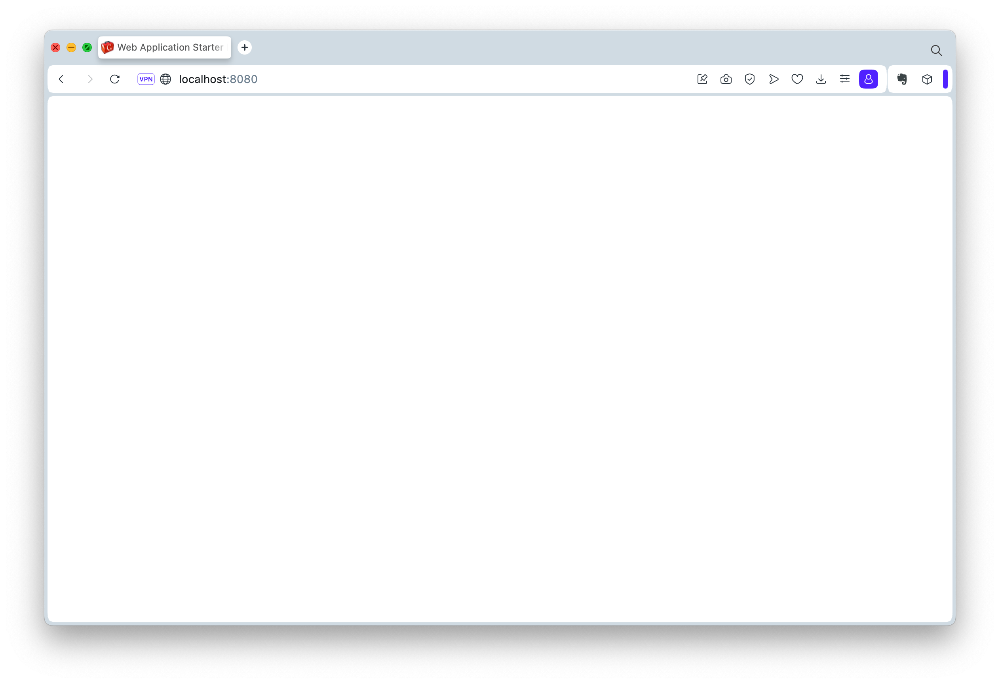
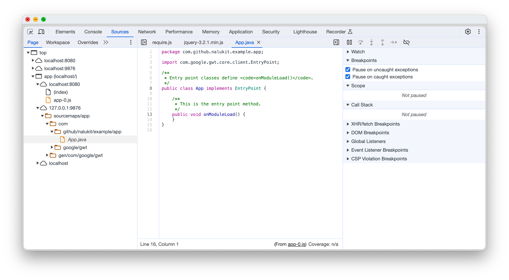
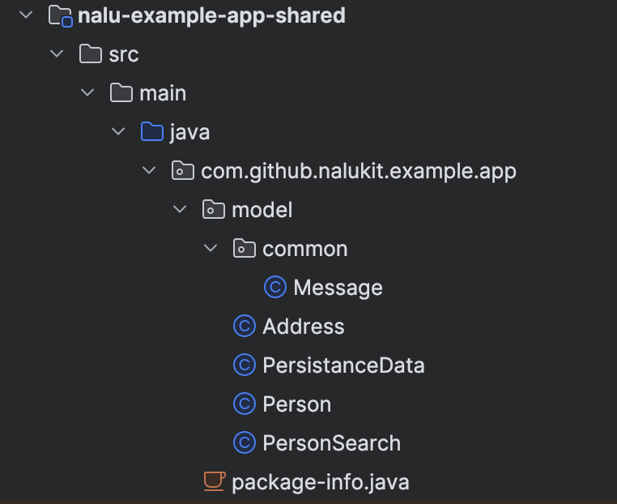
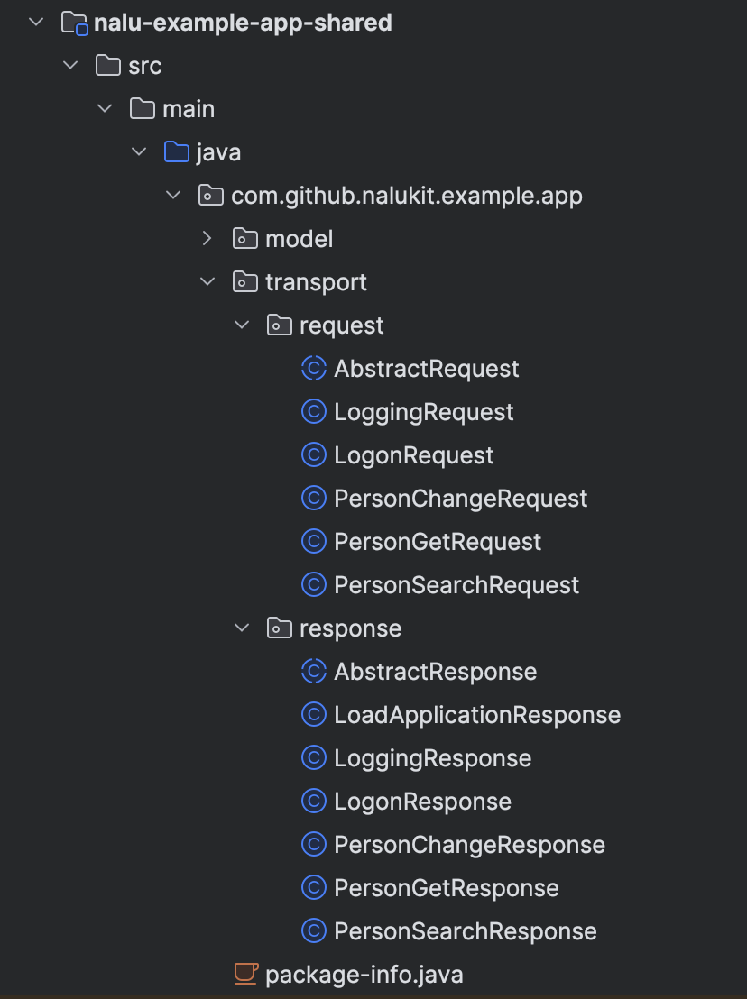
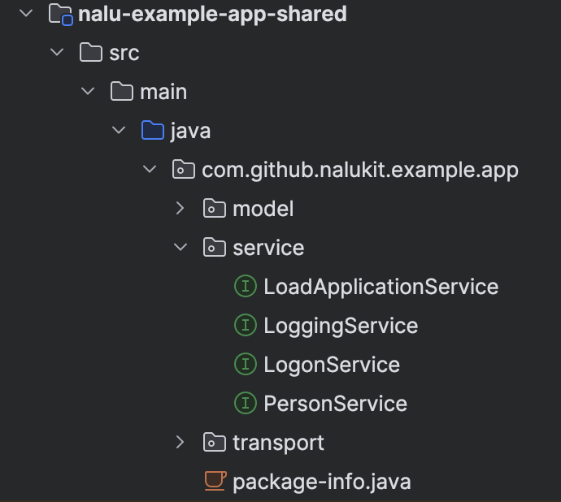
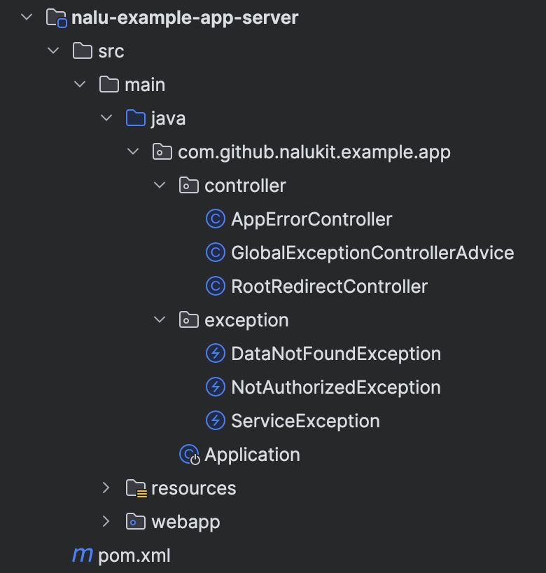

# Using Nalu

Nalu is a tiny and powerful framework. Getting started with Nalu will take a little effort. To help anyone starting with Nalu, we created this page.

This example will use multi module Maven project and Spring Boot on the server side. 

It has three screens (login, list, detail) and a filter popup. 

The source code of this example can be found [GitHub](https://github.com/NaluKit/nalu-examples/tree/main/nalu-example-app).
This guide will lead you to the process of setting up the project, walk through the sources and explain things. In 
many places we will reference the repo and ask you to copy the sources from the repo to focus on the important things. 

## Create a empty project

### Prerequisites

Spring Boot 3 requires Java 17. Make sure, that Java 17 is installed. If not, download and install the 
Java SE Development Kit (JDK) [from Eclipse Temurin](https://adoptium.net/de/temurin/releases/) for your platform.
Install the JDK by following the installation instructions.

To build and run the example, we need Apache Maven installed. If you don’t already have it, install [Apache Maven](https://maven.apache.org/download.cgi).

Make sure, that Maven and Java are added to your PATH.

### Create your web application

With Java and Maven installed, we need to generate the project. To do so, we use the [NaluKit/gwt-maven-springboot-archetype](https://github.com/NaluKit/gwt-maven-springboot-archetype/tree/main).

Next, open a terminal and choose the directory you like to generate the sources into. 
Now, you generate a new application project by using the following command:

```
mvn archetype:generate \
   -DarchetypeGroupId=com.github.nalukit.archetype \
   -DarchetypeVersion=LATEST \
   -DarchetypeArtifactId=clean-modular-springboot-webapp
```

Choose the folder, where you would like to generate the new application project. Run the archetype.

The archetype will request values for:

* **groupId**: com.github.nalukit.example
* **artifactId**: nalu-example-app
* **version**: HEAD-SNAPSHOT
* **package**: com.github.nalukit.example.app
* **module-short-name**: app

After entering the parameter above, the terminal shows something like that:

```
[INFO] Using property: module = App
Define value for property 'groupId': com.github.nalukit.example
Define value for property 'artifactId': nalu-example-app                                   
Define value for property 'version' 1.0-SNAPSHOT: : HEAD-SNAPSHOT
Define value for property 'package' com.github.nalukit.example: : com.github.nalukit.example.app
Define value for property 'module-short-name' app: : app
Confirm properties configuration:
module: App
groupId: com.github.nalukit.example
artifactId: nalu-example-app
version: HEAD-SNAPSHOT
package: com.github.nalukit.example.app
module-short-name: app
 Y: : 
```

Enter **Y** to continue.

Now, the new project will be generated and you see something like that:

```
[INFO] ----------------------------------------------------------------------------
[INFO] Using following parameters for creating project from Archetype: clean-modular-springboot-webapp:LATEST
[INFO] ----------------------------------------------------------------------------
[INFO] Parameter: groupId, Value: com.github.nalukit.example
[INFO] Parameter: artifactId, Value: nalu-example-app
[INFO] Parameter: version, Value: HEAD-SNAPSHOT
[INFO] Parameter: package, Value: com.github.nalukit.example.app
[INFO] Parameter: packageInPathFormat, Value: com/github/nalukit/example/app
[INFO] Parameter: package, Value: com.github.nalukit.example.app
[INFO] Parameter: module-short-name, Value: app
[INFO] Parameter: module, Value: App
[INFO] Parameter: groupId, Value: com.github.nalukit.example
[INFO] Parameter: artifactId, Value: nalu-example-app
[INFO] Parameter: version, Value: HEAD-SNAPSHOT
[INFO] Parent element not overwritten in /Users/gwt-user/Development/OpenSource/GWT/NaluKit/nalu-examples-parent/nalu-example-app/nalu-example-app-client/pom.xml
[INFO] Parent element not overwritten in /Users/gwt-user/Development/OpenSource/GWT/NaluKit/nalu-examples-parent/nalu-example-app/nalu-example-app-shared/pom.xml
[INFO] Parent element not overwritten in /Users/gwt-user/Development/OpenSource/GWT/NaluKit/nalu-examples-parent/nalu-example-app/nalu-example-app-server/pom.xml
[WARNING] CP Don't override file /Users/gwt-user/Development/OpenSource/GWT/NaluKit/nalu-examples-parent/nalu-example-app/nalu-example-app-server/src/main/webapp
[INFO] Project created from Archetype in dir: /Users/gwt-user/Development/OpenSource/GWT/NaluKit/nalu-examples-parent/nalu-example-app
[INFO] ------------------------------------------------------------------------
[INFO] BUILD SUCCESS
[INFO] ------------------------------------------------------------------------
[INFO] Total time:  01:01 min
[INFO] Finished at: 2023-12-28T12:29:04+01:00
[INFO] ------------------------------------------------------------------------
```

**Note**
Due to a bug in the Maven archetype plugin, the root POM gets generated with a lot of empty lines. Before we continue, we delete them.

Switch to the generated directory by entering `cd nalu-example-app`.

Listing of the directory (Windows: dir, Mac and Linux: ls -la), shows:

```
drwxr-xr-x   5 gwt-user  staff   160 Dec 28 12:29 nalu-example-app-client
drwxr-xr-x   4 gwt-user  staff   128 Dec 28 12:29 nalu-example-app-server
drwxr-xr-x   4 gwt-user  staff   128 Dec 28 12:29 nalu-example-app-shared
-rw-r--r--   1 gwt-user  staff  9029 Dec 28 12:29 pom.xml
-rw-r--r--   1 gwt-user  staff   656 Dec 28 12:29 readme.txt
```


Next, run: `mvn clean compile` before continuing.

### Run locally in super dev mode

To start the code server, run the following command:

`mvn gwt:codeserver -pl *-client -am`

Wait until the terminal shows the code server url 
```
[INFO] The code server is ready at http://127.0.0.1:9876/
```

We have to wait until we see this line to ensure, that the launcherDir is created inside. Once the line is visible,
enter the following command in another terminal window to start the spring boot application:

`mvn spring-boot:run -pl *-server -am`

Now, switch to your preferred browser (we suggest using: Chrome, FireFox or Opera) and enter:

`http://localhost:8080`

Yet, the application is running in super dev mode. You see something like this in the browser:



Well, it's empty!

Let's check the terminal windows. The one, running the code server, should show something like that:

```
[INFO] The code server is ready at http://127.0.0.1:9876/
[INFO] GET /recompile/app
[INFO]    Job com.github.nalukit.example.app.App_1_0
[INFO]       starting job: com.github.nalukit.example.app.App_1_0
[INFO]       binding: user.agent=safari
[INFO]       Compiling module com.github.nalukit.example.app.App
[INFO]          Unification traversed 10612 fields and methods and 987 types. 977 are considered part of the current module and 977 had all of their fields and methods traversed.
[INFO]          Compiling 1 permutation
[INFO]             Compiling permutation 0...
[INFO]             Linking per-type JS with 956 new/changed types.
[INFO]             Source Maps Enabled
[INFO]          Compile of permutations succeeded
[INFO]          Compilation succeeded -- 1,614s
[INFO]       Linking into /Users/gwt-user/Development/OpenSource/GWT/NaluKit/nalu-examples-parent/nalu-example-app/target/gwt/codeserver/com.github.nalukit.example.app.App/compile-2/war/app; Writing extras to /Users/gwt-user/Development/OpenSource/GWT/NaluKit/nalu-examples-parent/nalu-example-app/target/gwt/codeserver/com.github.nalukit.example.app.App/compile-2/extras/app
[INFO]          Link succeeded
[INFO]          Linking succeeded -- 0,094s
[INFO]       1,733s total -- Compile completed
[INFO] GET /recompile/app
[INFO]    Job com.github.nalukit.example.app.App_1_1
[INFO]       starting job: com.github.nalukit.example.app.App_1_1
[INFO]       binding: user.agent=safari
[INFO]       skipped compile because no input files have changed
[INFO]       0,014s total -- Compile completed
```

and the terminal with the Spring Boot application running:

```
[INFO] Attaching agents: []

  .   ____          _            __ _ _
 /\\ / ___'_ __ _ _(_)_ __  __ _ \ \ \ \
( ( )\___ | '_ | '_| | '_ \/ _` | \ \ \ \
 \\/  ___)| |_)| | | | | || (_| |  ) ) ) )
  '  |____| .__|_| |_|_| |_\__, | / / / /
 =========|_|==============|___/=/_/_/_/
 :: Spring Boot ::                (v3.1.6)

[2023-12-28 12:34:06.876] - 11526 INFORMATION [restartedMain] --- com.github.nalukit.example.app.Application: Starting Application using Java 17.0.8.1 with PID 11526 (/Users/hoss/Development/OpenSource/GWT/NaluKit/nalu-examples-parent/nalu-example-app/nalu-example-app-server/target/classes started by hoss in /Users/hoss/Development/OpenSource/GWT/NaluKit/nalu-examples-parent/nalu-example-app/nalu-example-app-server)
[2023-12-28 12:34:06.892] - 11526 INFORMATION [restartedMain] --- com.github.nalukit.example.app.Application: No active profile set, falling back to 1 default profile: "default"
Dez. 28, 2023 12:34:07 PM org.springframework.boot.web.embedded.tomcat.TomcatWebServer initialize
```

### Debugging in the Browser

In super dev mode, you can easily debug your client code in the browser. While running your application, 
open the dev tools in your browser. Select the Sources-tab and press ctrl-P (Windows/Linux) or cmd-P (macOS).
A popup opens. Enter App.java and press return.



Now, locate the App.java class inside the client module of the project. Add a `GWT.debugger();` statement to 
the `onModuleLoad`-method:

```java
public class App
    implements EntryPoint {
  public void onModuleLoad() {
    GWT.debugger();
  }
}
```

Switch back to the browser and refresh the page while letting the dev tools open. The debugger will stop execution 
at the `GWT.debugger();`-statement.

## Add Nalu and Domino dependencies to the project

The project will use the following deoendencies:

* [domino-rest](https://github.com/DominoKit/domino-rest): will be used for the client-server-communication 
* [malio](https://github.com/NaluKit/malio): will be used for validating the object send to the server
* [nalu](https://github.com/NaluKit/nalu): will be used for history management and routing
* [domino-ui](https://github.com/DominoKit/domino-ui): will be used for creating the UI

Please visit the repos for further information.

### Setting up parent POM

The following changes to the parent POM needs to be done:

#### Properties

```
    <domino-ui.version>2.0.0-RC5</domino-ui.version>
    <domino.rest.version>1.0.2</domino.rest.version>
    <gwt-editor.version>1.0.0-RC1</gwt-editor.version>
    <malio.version>1.0.0</malio.version>
    <nalu.version>2.12.7</nalu.version>
```

#### Dependencies

Add the following dependencies to **dependencyManagement** -> **dependencies**:

```
       <dependency>
        <groupId>org.gwtproject.editor</groupId>
        <artifactId>gwt-editor</artifactId>
        <version>${gwt-editor.version}</version>
      </dependency>
      <dependency>
        <groupId>org.gwtproject.editor</groupId>
        <artifactId>gwt-editor-processor</artifactId>
        <version>${gwt-editor.version}</version>
      </dependency>

      <dependency>
        <groupId>com.github.nalukit</groupId>
        <artifactId>malio</artifactId>
        <version>${malio.version}</version>
      </dependency>

      <dependency>
        <groupId>com.github.nalukit</groupId>
        <artifactId>malio-processor</artifactId>
        <version>${malio.version}</version>
        <scope>provided</scope>
      </dependency>

      <dependency>
        <groupId>com.github.nalukit</groupId>
        <artifactId>nalu</artifactId>
        <version>${nalu.version}</version>
      </dependency>
      <dependency>
        <groupId>com.github.nalukit</groupId>
        <artifactId>nalu-processor</artifactId>
        <version>${nalu.version}</version>
      </dependency>
      <dependency>
        <groupId>com.github.nalukit</groupId>
        <artifactId>nalu-plugin-domino-v2</artifactId>
        <version>${nalu.version}</version>
      </dependency>

      <dependency>
        <groupId>org.dominokit</groupId>
        <artifactId>domino-rest-client</artifactId>
        <version>${domino.rest.version}</version>
      </dependency>
      <dependency>
        <groupId>org.dominokit</groupId>
        <artifactId>domino-rest-processor</artifactId>
        <version>${domino.rest.version}</version>
      </dependency>

      <dependency>
        <groupId>org.dominokit</groupId>
        <artifactId>domino-ui</artifactId>
        <version>${domino-ui.version}</version>
      </dependency>
      <dependency>
        <groupId>org.dominokit</groupId>
        <artifactId>domino-ui</artifactId>
        <version>${domino-ui.version}</version>
        <classifier>sources</classifier>
      </dependency>
```

### Setting up client POM

The following changes to the client POM needs to be done:

#### Dependencies

Add the following dependencies to **dependencyManagement** -> **dependencies**:

```
    <dependency>
      <groupId>org.gwtproject.editor</groupId>
      <artifactId>gwt-editor</artifactId>
    </dependency>
    <dependency>
      <groupId>org.gwtproject.editor</groupId>
      <artifactId>gwt-editor-processor</artifactId>
    </dependency>

    <dependency>
      <groupId>com.github.nalukit</groupId>
      <artifactId>nalu</artifactId>
    </dependency>
    <dependency>
      <groupId>com.github.nalukit</groupId>
      <artifactId>nalu-processor</artifactId>
    </dependency>
    <dependency>
      <groupId>com.github.nalukit</groupId>
      <artifactId>nalu-plugin-domino-v2</artifactId>
    </dependency>

    <!-- https://mvnrepository.com/artifact/org.yaml/snakeyaml -->
    <dependency>
      <groupId>org.yaml</groupId>
      <artifactId>snakeyaml</artifactId>
    </dependency>
```

### Setting up shared POM

The following changes to the shared POM needs to be done:

#### Dependencies

Add the following dependencies to **dependencyManagement** -> **dependencies**:

```
    <dependency>
      <groupId>org.dominokit</groupId>
      <artifactId>domino-rest-client</artifactId>
    </dependency>
    <dependency>
      <groupId>org.dominokit</groupId>
      <artifactId>domino-rest-processor</artifactId>
      <version>${domino.rest.version}</version>
    </dependency>
    <dependency>
      <groupId>com.github.nalukit</groupId>
      <artifactId>malio</artifactId>
    </dependency>
    <dependency>
      <groupId>com.github.nalukit</groupId>
      <artifactId>malio-processor</artifactId>
    </dependency>
```

### Setting up server POM

There are no additional dependencies needed.

## Shared Module

THe shared module contains classes needed in the client- and server-module. Usually, this will be:

* DTOs
* Service definitions
* request and response models.


### DTOs

First, copy the [content of the model](https://github.com/NaluKit/nalu-examples/tree/main/nalu-example-app/nalu-example-app-shared/src/main/java/com/github/nalukit/example/app/model)
package into the package located in the shared-module. Once copied, it should like that:



Let's look into a DTO.

```java
package com.github.nalukit.example.app.model;

import com.github.nalukit.malio.shared.annotation.MalioValidator;
import com.github.nalukit.malio.shared.annotation.field.MaxLength;
import com.github.nalukit.malio.shared.annotation.field.NotBlank;
import com.github.nalukit.malio.shared.annotation.field.NotNull;
import org.dominokit.jackson.annotation.JSONMapper;

@JSONMapper
@MalioValidator(generateValidateMethod = false)
public class Person {

  private long id;

  @NotNull
  @NotBlank
  @MaxLength(64)
  private String name;

  @NotNull
  @NotBlank
  @MaxLength(64)
  private String firstName;

  @NotNull
  private Address address;

  public Person() {
    super();
  }

  public Person(long id,
                String name,
                String firstName,
                Address adress) {
    super();

    this.id        = id;
    this.name      = name;
    this.firstName = firstName;
    this.address   = adress;
  }

  public long getId() {
    return id;
  }

  public void setId(long id) {
    this.id = id;
  }

  public String getName() {
    return name;
  }

  public void setName(String name) {
    this.name = name;
  }

  public String getFirstName() {
    return firstName;
  }

  public void setFirstName(String firstName) {
    this.firstName = firstName;
  }

  public Address getAddress() {
    return address;
  }

  public void setAddress(Address address) {
    this.address = address;
  }

}
```

Creating `RestController` in Spring Boot is very easy (we look at it later). We use REST to communicate from the client
with the server. All we need to do is to us something, that will create a client that let us call REST service and
does the serialize and deserialize job. And that is what [domino-rest](https://github.com/DominoKit/domino-rest) does.

In case a DTO is transferred from or to the server, we need to annotate the class with `@JSONMapper`.
Annotating a class with `@JSONMapper` tells domino-rest to create a serializer and deserializer. Now, we can get a JSON from
an object and an object from JSON.

Using Spring Boot RestControllers exposes services to the web. Therefore Spring Boot RestControllers  need to be protected.
Besides authentication and authorisation (not covered here), the content of a JSON itself needs to be validated. 
[malio](https://github.com/NaluKit/malio) is a tiny framework, that does this job. Using malio, validators will be created and
can be used to validate the content of the JSON. So, everything, that is input to a service, should be validated.

To create a validator with malio, just add the `@MalioValidator(generateValidateMethod = false)`-annotation. Usually, malio 
generates two methods:

* **check**-method: will throw an exception as soon as an error is detected
* **validate**-method: will validate the POJO, collect all error messages and return a validation result 

We only need the check method. Adding `generateValidateMethod = false` to the annotation will tell malio to
generate only the **check**-method.

Then we add annotations to the items of the POJO to tell malio, what to check. The [malio README](https://github.com/NaluKit/malio?tab=readme-ov-file#supported-annotations)
provides a list of annotations supported by malio.

### Transfer-Objects

Using REST, we can have **GET**- or **POST**-request. This example will use **POST** in any case the client requests 
information from the server and send the request embedded inside a request-object. The service will return a response-object
containing the desired information. Exceptions or errors will be translated into HTTP status codes. 

Copy the [content of the transport](https://github.com/NaluKit/nalu-examples/tree/main/nalu-example-app/nalu-example-app-shared/src/main/java/com/github/nalukit/example/app/transport)
package into the package located in the shared-module. Once copied, it should like that:



This is the code of the LogonRequest:

```java
package com.github.nalukit.example.app.transport.request;

import com.github.nalukit.malio.shared.annotation.MalioValidator;
import com.github.nalukit.malio.shared.annotation.field.MaxLength;
import com.github.nalukit.malio.shared.annotation.field.NotBlank;
import com.github.nalukit.malio.shared.annotation.field.NotNull;
import org.dominokit.jackson.annotation.JSONMapper;
import org.dominokit.rest.shared.request.RequestBean;

@JSONMapper
@MalioValidator(generateValidateMethod = false)
public class LogonRequest
    extends AbstractRequest
    implements RequestBean {

  @NotNull
  @NotBlank
  @MaxLength(32)
  private String userId;
  @NotNull
  @NotBlank
  @MaxLength(32)
  private String password;

  public LogonRequest() {
  }

  public LogonRequest(String userId,
                      String password) {
    this.userId   = userId;
    this.password = password;
  }

  public String getUserId() {
    return userId;
  }

  public void setUserId(String userId) {
    this.userId = userId;
  }

  public String getPassword() {
    return password;
  }

  public void setPassword(String password) {
    this.password = password;
  }

}
```

Similar to the DTOs the domino-rest and malio-annotations are used.

### Define the ServiceFactory

At least, we need ServiceFactories to call the RestController on the server side. [domino-rest](https://github.com/DominoKit/domino-rest)
will create these ServiceFactories. To trigger the creation of a ServiceFactory, a interface is needed.

Copy the [content of the service](https://github.com/NaluKit/nalu-examples/tree/main/nalu-example-app/nalu-example-app-shared/src/main/java/com/github/nalukit/example/app/service)
package into the package located in the shared-module. Once copied, it should like that:



This is the code of the LogonService:

```java
package com.github.nalukit.example.app.service;

import com.github.nalukit.example.app.transport.request.LogonRequest;
import com.github.nalukit.example.app.transport.response.LogonResponse;
import org.dominokit.rest.shared.request.service.annotations.RequestBody;
import org.dominokit.rest.shared.request.service.annotations.RequestFactory;

import javax.ws.rs.POST;
import javax.ws.rs.Path;

@RequestFactory(serviceRoot = "service/example")
@Path("/logon")
public interface LogonService {

  @POST
  @Path("/login")
  LogonResponse login(@RequestBody LogonRequest request);

}
```

Running a `mvn clean compile` domino-rest will generate a **LogonServiceFactory** which will be used to send logon data to the server.

## Server Module

Now, with the shared module setup done, we start working on the server classes. 

### Exceptions and Controller

Before taking a deeper look, we copy the content of the `exception`- and `controller`-package
into our project. Once copied, we will this structure:



All exceptions will extend `RuntimeException` to avoid adding `throws xx` to method signature. There are three exceptions:

* **DataNotFoundException**: will be thrown in case no data exist for the key
* **NotAuthorizedException**: will be thrown in case the user is not authorized
* **ServiceException**: will be thrown in case something inside a service goes wrong


* **


